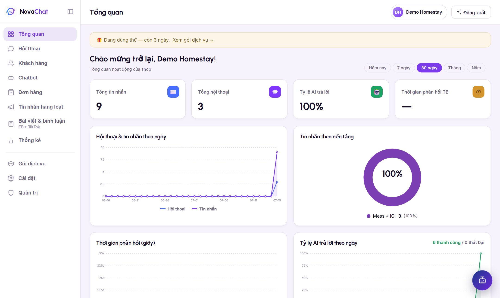
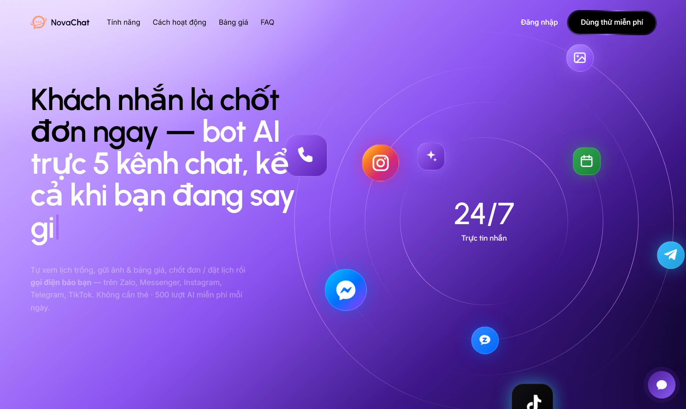
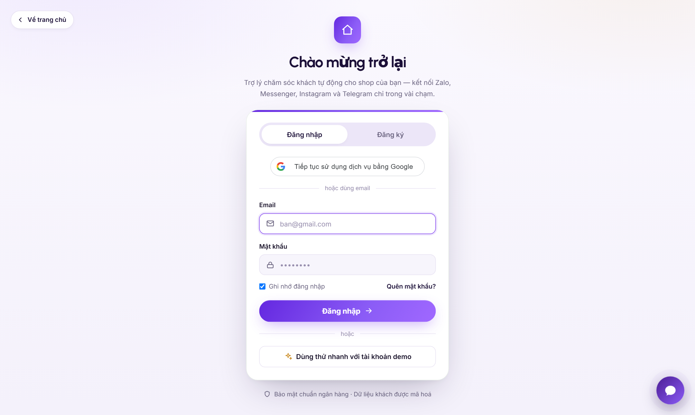
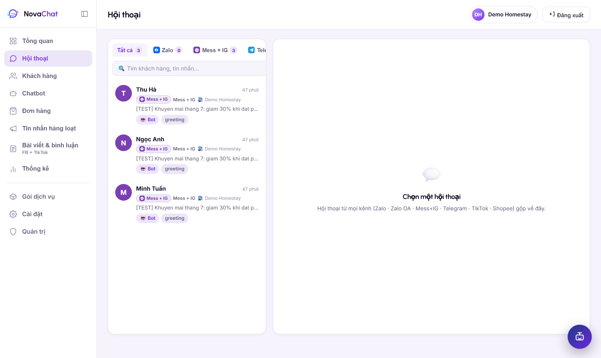
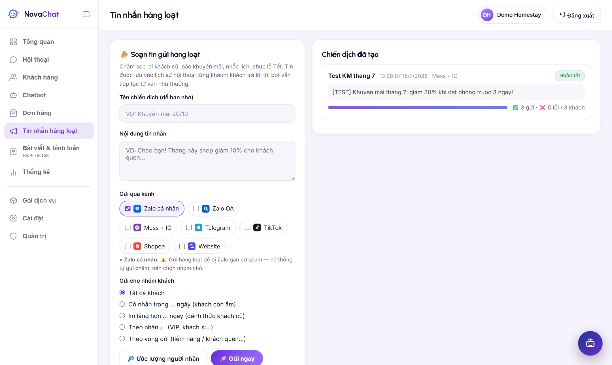
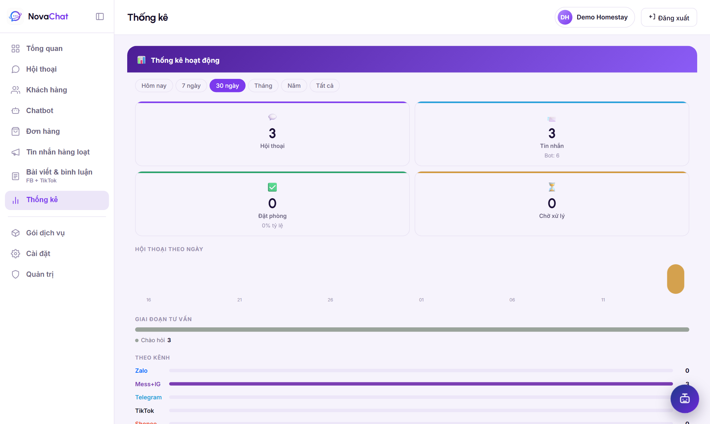
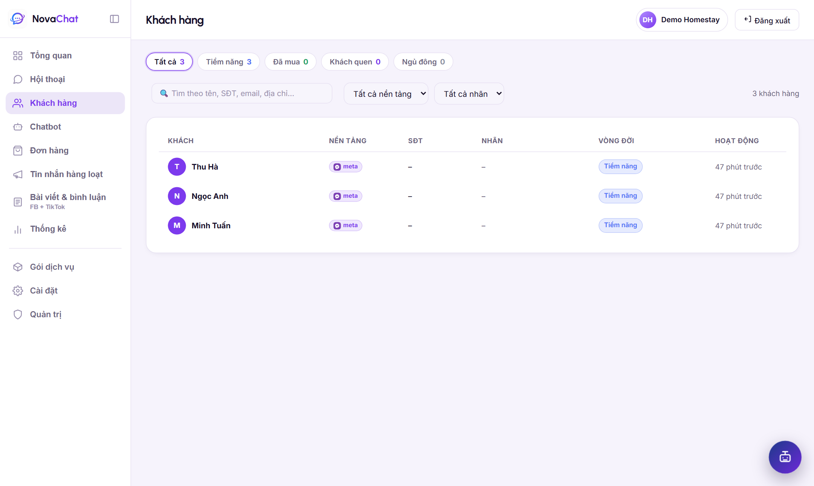
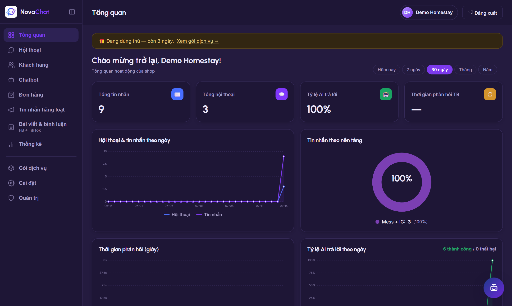
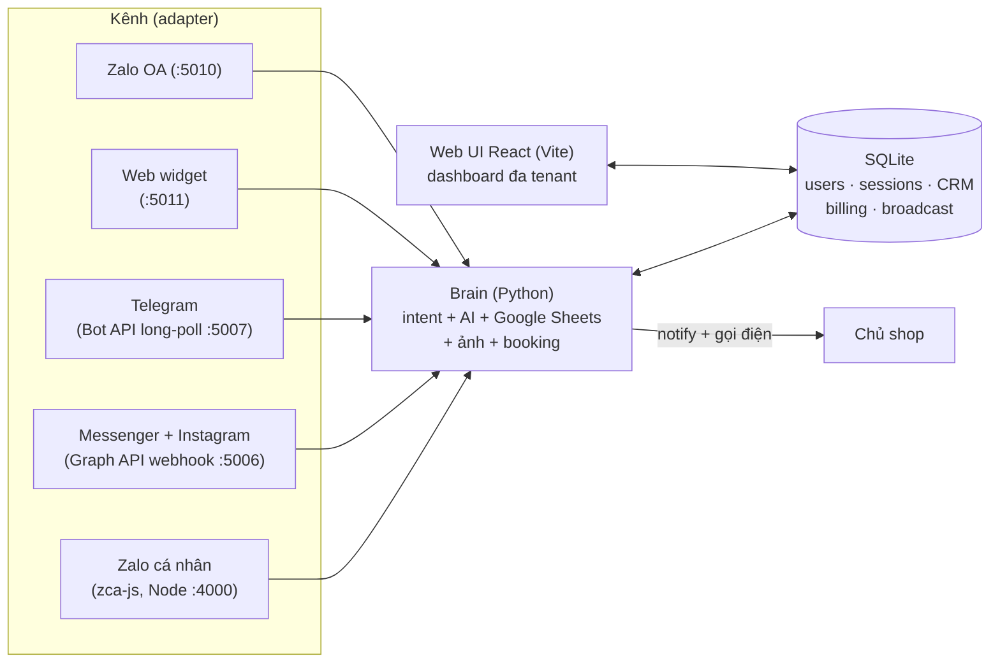

# NovaChat — Trợ lý AI chăm sóc khách đa kênh cho shop nhỏ

> Bot AI trả lời khách 24/7 trên **Zalo, Facebook Messenger, Instagram, Telegram, Zalo OA và widget chat website** — tự tra lịch/bảng giá từ Google Sheets, gửi ảnh dịch vụ, chốt đơn, và **gọi điện báo chủ** khi khách cần người thật. Một "não bot" duy nhất, cắm kênh nào cũng chạy.



## Tính năng chính

- 🤖 **AI tư vấn & chốt khách 24/7** — DeepSeek / Groq / GPT (chọn model theo từng app), có cơ chế override theo intent + câu mẫu cố định.
- 🧠 **Dạy AI trong 1 phút** — dán link Google Sheet/Doc/PDF/DOCX, AI tự đọc (service account), tự nhận diện sheet lịch/dữ liệu, tự soạn kịch bản tư vấn; có khung Test Bot chat thử trước khi chạy thật.
- 📅 **Tự tra lịch & tồn kho** — khách hỏi "hôm nay còn chỗ không" là bot tra Google Sheets thật và trả lời chính xác.
- 🖼️ **Gửi ảnh & bảng giá tự động**, 📞 **nhắn nhóm + gọi điện cho chủ tới khi bắt máy** (Telethon) khi khách chốt.
- 💬 **Hộp thư hợp nhất** — mọi kênh về 1 màn hình; chủ nhắn xen vào là bot tự nhường (owner-takeover), phân công hội thoại cho nhân viên (team roles: owner/staff).
- 📣 **Tin nhắn hàng loạt (broadcast/remarketing)** — lọc khách theo kênh / mức hoạt động / nhãn CRM / vòng đời, gửi có throttle, log từng khách.
- 🗂️ **CRM nhẹ** — tag, vòng đời khách (lead → khách → quay lại → ngủ đông), gộp trùng SĐT, nhắc việc, voucher + tích điểm.
- 📊 **Thống kê** — hội thoại/tin nhắn theo ngày, tỷ lệ AI trả lời, phân bổ theo kênh & giai đoạn tư vấn.
- 🌐 **5 ngôn ngữ giao diện** (Việt/Anh/Hàn/Trung/Nhật) + 🌙 **dark mode**.
- 💳 **Gói dịch vụ & quota AI** — trial, gói tháng, ví usage; gate theo từng chủ shop.

## Ảnh màn hình

| | |
|---|---|
|  Trang giới thiệu |  Đăng nhập (OTP quên mật khẩu, Google login) |
|  Hộp thư hợp nhất đa kênh |  Tin nhắn hàng loạt |
|  Thống kê hoạt động |  Khách hàng (CRM) |
|  Dark mode | |

## Kiến trúc

Nguyên tắc cốt lõi: **tách "não" khỏi kênh**. Toàn bộ logic tư vấn nằm trong `Brain` (channel-agnostic); mỗi kênh chỉ là 1 class implement interface `Channel` (`send_text`, `send_room_photos`, `notify_owner`, `call_owner`...) + 1 webhook/poller nhận tin. Thêm kênh mới = viết 1 adapter, không đụng não.



- **Backend:** Python (Flask + waitress), mỗi kênh 1 tiến trình/cổng riêng; bridge :5005 giữ auth, hội thoại, broadcast, billing.
- **Frontend:** React + Vite (`web-ui/`), design system CSS variables, i18n tự viết (fragment dict theo khu vực màn hình).
- **Zalo cá nhân:** service Node riêng (`zalo-node/`, zca-js, QR login, multi-account).
- **Multi-tenant:** hội thoại/app/broadcast tách theo workspace, nhân viên quy về workspace của chủ; guard tập trung ở bridge.
- **Bảo mật:** PBKDF2 200k vòng, token phiên trong DB, rate-limit chống dò mật khẩu, OTP email 15 phút, Google id_token verify phía server (kiểm `aud`), security headers, appsecret_proof khi gọi Graph API.

## Chạy local

```bash
# 1. Backend Python
pip install -r requirements.txt
copy .env.example .env        # điền key AI (DEEPSEEK_API_KEY hoặc GROQ_API_KEY) + Google credentials

# 2. Node service (Zalo) + Web UI
cd zalo-node && npm install && cd ..
cd web-ui && npm install && cd ..

# 3. Bật tất cả (4 cửa sổ: Zalo Node, Brain, Meta, Web UI)
start-all.bat                 # dừng: stop-all.bat
```

Mở `http://localhost:5173` → đăng ký tài khoản → thêm app → kết nối kênh ngay trong giao diện (quét QR Zalo / đăng nhập Facebook / dán token BotFather). Chi tiết: [docs/SETUP.md](docs/SETUP.md) · [docs/ARCHITECTURE.md](docs/ARCHITECTURE.md) · [docs/DEPLOY.md](docs/DEPLOY.md).

## Test

44 file test tự chạy trong `tests/` (auth, tenant, billing, broadcast, từng kênh, sheets, security...):

```bash
python tests/test_auth.py       # 45/45
python tests/test_broadcast.py  # 43/43
python tests/test_meta.py       # 50/50
```

## Trạng thái & giới hạn đã biết

- Kênh chạy thật end-to-end: Zalo cá nhân, Messenger + Instagram, Telegram, Web widget, Zalo OA. TikTok/Shopee mới ở mức scaffold (mock, chờ duyệt API).
- Messenger/Instagram cho khách lạ cần Meta App Review (`pages_messaging`, `instagram_manage_messages`) — dev mode chạy đủ cho admin/tester.
- Nút bật/tắt bot đang là cờ toàn cục (chưa tách theo shop); session Telethon của acc gọi cần mã hoá trước khi bán thật.
