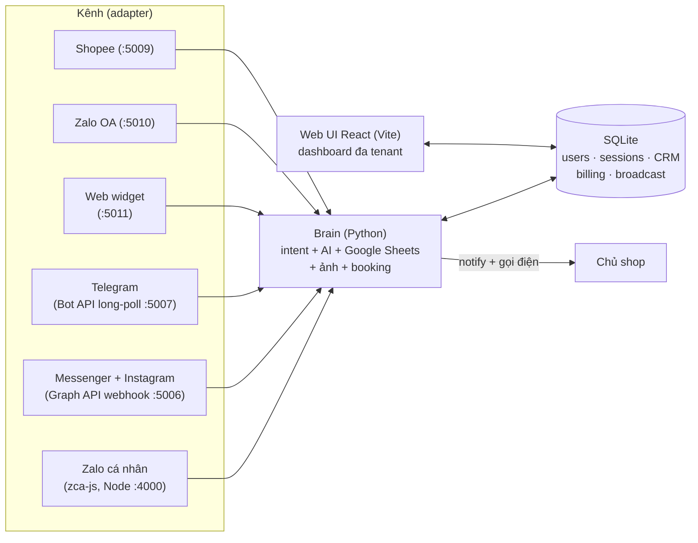

# NovaChat — SaaS trợ lý AI chăm sóc khách đa kênh cho shop nhỏ


> Bot AI trả lời khách 24/7 trên **Zalo, Facebook Messenger, Instagram, Telegram, Zalo OA, Shopee và widget chat website** — tự tra lịch/bảng giá từ Google Sheets, gửi đúng bộ ảnh theo ngữ cảnh, chốt đơn, và **gọi điện báo chủ tới khi bắt máy** khi khách cần người thật. Một "não bot" duy nhất, cắm kênh nào cũng chạy. Multi-tenant thật sự: **1 tài khoản quản lý nhiều shop**, mỗi shop có bộ kênh + não AI + dữ liệu khách riêng, dùng chung 1 gói cước.
>
> *EN: A multi-tenant SaaS that gives Vietnamese small businesses an AI sales agent across 7 chat channels — one channel-agnostic "brain" (intent engine + RAG + guarded LLM), per-shop knowledge bases, unified inbox, CRM, broadcast, billing with AI quotas, and an escalation path that literally rings the owner's phone. ~41k LOC, 52 automated test suites.*


## Tính năng chính

- 🤖 **AI tư vấn & chốt khách 24/7** — DeepSeek / Groq / GPT (chọn model theo từng app), có cơ chế override theo intent + câu mẫu cố định.
- 🧠 **Dạy AI trong 1 phút** — dán link Google Sheet/Doc/PDF/DOCX, AI tự đọc (service account), tự nhận diện sheet lịch/dữ liệu, tự soạn kịch bản tư vấn; có khung Test Bot chat thử trước khi chạy thật.
- 📅 **Tự tra lịch & tồn kho** — khách hỏi "hôm nay còn chỗ không" là bot tra Google Sheets thật và trả lời chính xác.
- 🖼️ **Gửi ảnh & bảng giá tự động** + 🔔 **báo chủ có chọn lọc theo sự kiện** (chốt đơn, khách cần gặp người, bot bí) — mức "Gọi" thì đổ chuông điện thoại thật.
- 💬 **Hộp thư hợp nhất** — mọi kênh về 1 màn hình; chủ nhắn xen vào là bot tự nhường (owner-takeover), phân công hội thoại cho nhân viên (team roles: owner/staff).
- 📣 **Tin nhắn hàng loạt (broadcast/remarketing)** — lọc khách theo kênh / mức hoạt động / nhãn CRM / vòng đời, gửi có throttle, log từng khách.
- 🗂️ **CRM nhẹ** — tag, vòng đời khách (lead → khách → quay lại → ngủ đông), gộp trùng SĐT, nhắc việc, voucher + tích điểm.
- 🏬 **Nhiều shop trong 1 tài khoản** — mỗi shop là 1 workspace độc lập (kênh, hội thoại, khách, đơn, não AI, thư viện ảnh riêng; mỗi shop đúng 1 bot mỗi loại kênh), chuyển shop ngay trên thanh công cụ, dùng chung 1 gói cước.
- 🖼️🧠 **AI biết thư viện ảnh** — não bot đọc danh mục bộ ảnh của shop và **tự quyết định đính bộ ảnh phù hợp** vào câu trả lời (thẻ điều khiển ẩn), không còn phụ thuộc khách gõ trúng từ khoá.
- 💡 **Bot tự học từ hội thoại** — chủ trả lời tay câu bot bí → AI đề xuất mẩu tri thức mới, chủ duyệt 1 chạm là vào não; kèm **trí nhớ AI theo từng khách** và **Copilot quản trị** (trợ lý AI thao tác dashboard giúp chủ).
- 📳 **Gọi khẩn qua Telegram cho mọi kênh** — chủ tự cài 1 acc Telegram phụ (quét QR); khách cần gặp người thật ở bất kỳ kênh nào là acc phụ đổ chuông acc chính, gọi lại mỗi 3 phút tới khi bắt máy.
- 📊 **Thống kê đo thật** — thời gian phản hồi bot trung bình + P95 theo ngày, tỷ lệ AI trả lời (bot/khách), đếm câu bot bí; tách số liệu theo từng shop.
- 🌐 **5 ngôn ngữ giao diện** (Việt/Anh/Hàn/Trung/Nhật) + 🌙 **dark mode**.
- 💳 **Gói dịch vụ & quota AI** — trial, gói tháng, ví usage tính theo token từng model; gate theo từng chủ shop, cảnh báo hết hạn/hết quota qua email.

## Ảnh màn hình

| | |
|---|---|
|  Trang giới thiệu |  Đăng nhập (OTP quên mật khẩu, Google login) |
|  Hộp thư hợp nhất đa kênh |  Tin nhắn hàng loạt |
|  Thống kê hoạt động |  Khách hàng (CRM) |
|  Dark mode | |

## Kiến trúc

Nguyên tắc cốt lõi: **tách "não" khỏi kênh**. Toàn bộ logic tư vấn nằm trong `Brain` (channel-agnostic); mỗi kênh chỉ là 1 class implement interface `Channel` (`send_text`, `send_room_photos`, `notify_owner`, `call_owner`...) + 1 webhook/poller nhận tin. Thêm kênh mới = viết 1 adapter, không đụng não.



- **Backend:** Python (Flask + waitress), mỗi kênh 1 tiến trình/cổng riêng; bridge :5005 giữ auth, hội thoại, broadcast, billing.
- **Frontend:** React + Vite (`web-ui/`), design system CSS variables, i18n tự viết (fragment dict theo khu vực màn hình).
- **Zalo cá nhân:** service Node riêng (`zalo-node/`, zca-js, QR login, multi-account).
- **Multi-tenant & multi-shop:** mọi dữ liệu đóng dấu tenant theo workspace; **shop con = 1 chuỗi workspace mới** nên toàn bộ máy móc tenant sẵn có (kênh, não, CRM, thống kê, broadcast) tự tách theo shop mà không sửa từng module; nhân viên quy về workspace của chủ; guard tập trung ở bridge.
- **Bảo mật:** PBKDF2 200k vòng, token phiên trong DB, rate-limit + lockout chống dò mật khẩu, OTP email 15 phút, Google id_token verify phía server (kiểm `aud`), security headers, appsecret_proof khi gọi Graph API, verify chữ ký webhook (Meta/Zalo OA/Shopee), token kênh + phiên Telethon **mã hoá at-rest**, chống IDOR chéo tenant có test riêng.

## Điểm nhấn kỹ thuật

- **Channel-agnostic core:** thêm kênh mới = viết 1 adapter implement interface `Channel` — não bot, CRM, billing, thống kê không đổi 1 dòng. `channel_registry` là nguồn sự thật duy nhất về kênh, kèm **test tĩnh chống drift** (quét source mọi route mới, thiếu guard sở hữu là CI đỏ).
- **RAG thực dụng cho tiếng Việt:** BM25-lite + IDF, từ điển teencode (~50 biến thể "k/bn/ib/stk…"), kho nhỏ thì nhồi toàn bộ (0 tra trượt) — kèm chấm điểm não bot bằng LLM-judge chạy nightly.
- **Prompt xếp theo context-cache:** phần ổn định theo shop (persona/KB/quy tắc) đứng trước, phần theo khách đứng sau — tận dụng prefix-cache của DeepSeek để giảm chi phí mỗi tin.
- **Đáng tin khi tiền thật:** hold giữ chỗ 30′ chống double-booking + đọc tươi Sheets trước khi chốt; broadcast ghi log từng người nhận → crash giữa chừng bấm "gửi lại" là **resume đúng chỗ, không gửi trùng**; các thao tác đua (start chiến dịch, quota) dùng check-and-set nguyên tử ở tầng SQL.
- **Vận hành đo được:** thời gian phản hồi bot ghi tại não (avg/P95/ngày, tự dọn sau 90 ngày), health endpoint từng service, circuit-breaker AI, backup DB tự động, alert Telegram khi kênh Zalo rớt phiên.
- **Kiểm thử là văn hoá:** 52 bộ test (~1.700 phép kiểm) phủ auth, tenant/IDOR, billing, broadcast resume, từng kênh, RAG, security — mỗi tính năng mới đi kèm test khoá hành vi.

## Chạy local

```bash
# 1. Backend Python
pip install -r requirements.txt
copy .env.example .env        # điền key AI (DEEPSEEK_API_KEY hoặc GROQ_API_KEY) + Google credentials

# 2. Node service (Zalo) + Web UI
cd zalo-node && npm install && cd ..
cd web-ui && npm install && cd ..

# 3. Bật tất cả (4 cửa sổ: Zalo Node, Brain, Meta, Web UI)
start-all.bat                 # dừng: stop-all.bat
```

Mở `http://localhost:5173` → đăng ký tài khoản → thêm app → kết nối kênh ngay trong giao diện (quét QR Zalo / đăng nhập Facebook / dán token BotFather). Chi tiết: [docs/SETUP.md](docs/SETUP.md) · [docs/ARCHITECTURE.md](docs/ARCHITECTURE.md) · [docs/DEPLOY.md](docs/DEPLOY.md).

## Test

**52 bộ test** tự chạy trong `tests/` với **hơn 1.700 phép kiểm** (auth, multi-tenant/IDOR, shop con, billing, broadcast + resume, từng kênh, RAG, latency, security...):

```bash
python tests/test_auth.py       # 46/46
python tests/test_shops.py      # 45/45 — nhiều shop trong 1 tài khoản
python tests/test_broadcast.py  # 52/52
python tests/test_meta.py       # 63/63
python tests/test_bridge.py     # 49/49 — kèm E2E đo thời gian phản hồi
```

## Trạng thái & giới hạn đã biết

- Kênh chạy thật end-to-end: Zalo cá nhân, Messenger + Instagram, Telegram, Web widget, Zalo OA. Shopee ở mức scaffold (mock, chờ Shopee duyệt app vendor).
- Messenger/Instagram cho khách lạ cần Meta App Review (`pages_messaging`, `instagram_manage_messages`) — dev mode chạy đủ cho admin/tester.
- Bật/tắt bot đã tách per-bot/per-account/per-Page trên mọi kênh — mỗi shop tự bật/tắt bot của mình, không đụng shop khác; secret kênh + session Telethon mã hoá at-rest, production public **bắt buộc** `NOVACHAT_SECRET_KEY` (thiếu là từ chối khởi động).
- Chống double-booking bằng hold giữ chỗ 30′ + đọc tươi Sheets trước khi chốt — nhưng bot **không ghi ngược** vào Sheet, chủ vẫn là người xác nhận cuối.
- Kênh Zalo cá nhân dùng thư viện unofficial (zca-js) — có rủi ro khoá tài khoản theo chính sách Zalo; khuyến nghị shop bán thật ưu tiên Zalo OA.
